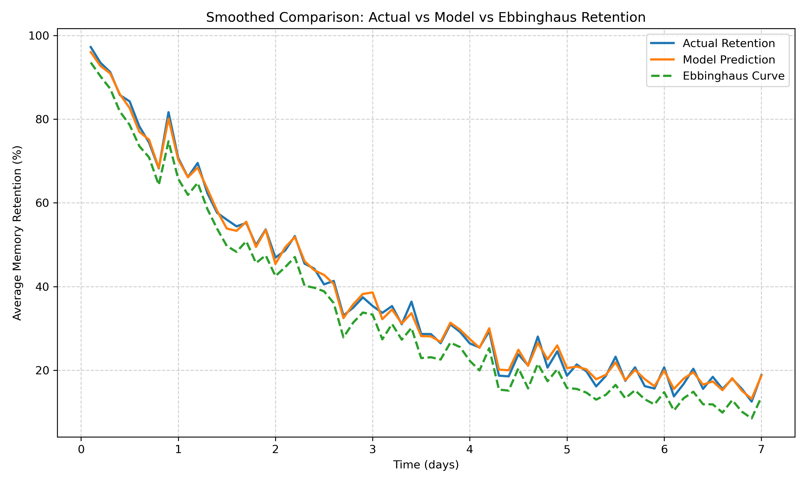

# 🧠 Modeling Memory Retention with Behavioral Factors using XGBoost & SHAP



> **Bridging classical cognitive theory with interpretable machine learning.**  
> Predict memory retention by enhancing Ebbinghaus’s Forgetting Curve with simulated behavioral data.

---

## 📌 Overview

This project introduces a scalable and explainable machine learning model that **predicts memory retention** by integrating **Ebbinghaus’s forgetting curve** with realistic behavioral and contextual factors such as **stress level, sleep quality, and learning methods**. We generate a large synthetic dataset and apply an optimized **XGBoost regression pipeline**, achieving impressive predictive performance and interpretability using **SHAP (SHapley Additive exPlanations)**.

---

## 🔍 Research Objective

> Traditional models like Ebbinghaus's curve explain memory decay purely as a function of time. However, they ignore behavioral variables known to influence cognition.

This research:
- **Simulates memory decay using Ebbinghaus’s formula**
- **Augments data with behavioral features** (e.g., learning strategy, sleep, stress)
- **Builds and tunes an interpretable XGBoost model**
- **Explains predictions using SHAP**

📄 Read the full research paper: [`Modeling Memory Retention with Ebbinghaus’s Forgetting Curve and Interpretable Machine Learning on Behavioral Factors`](./research_paper.pdf)

---

## ✨ Key Features

- 📈 Predictive modeling of memory retention (regression)
- 🧪 Synthetic data generation rooted in cognitive psychology
- ⚙️ Full preprocessing and ML pipeline (encoding, scaling, tuning)
- ✅ Evaluation against Ebbinghaus baseline (RMSE, MAE, R²)
- 🔍 SHAP-based interpretability for feature contributions
- 🧠 Insights into how behavior affects memory

---

## 📁 Project Structure

```bash
.
├── data_cleaning.ipynb              # Data preprocessing and cleaning steps
├── Ebbinghaus_dataset.csv           # Raw synthetic dataset
├── forgetting_curve.csv             # Base retention values using Ebbinghaus equation
├── updated_data.csv                 # Cleaned and enriched dataset
├── generating_report.ipynb         # Visualization and SHAP report generation
├── memory_retention_model.pkl      # Trained XGBoost model
├── memory_retention_model_v1.1.pkl # Optimized model with best hyperparameters
├── model_deployment.py             # Script to deploy model (e.g., Streamlit/Flask ready)
├── model_training.ipynb            # Complete ML pipeline with training & tuning
├── titanic-using-pipeline.ipynb    # Template notebook for pipeline architecture
├── retention_comparison.pdf/png    # Visual comparison between models
├── data_report.html                # EDA report (auto-generated)
├── README.md                       # You're here!
└── Previous_data/
    ├── retention_metrics.csv       # Historical model metrics
    └── baseline_curve.csv          # Original Ebbinghaus predictions

```

# Define the expanded markdown content with proper formatting and tables

expanded_sections = """
## 🚀 Installation & Usage

### 1. Clone the repository

```bash
git clone https://github.com/yourusername/memory-retention-xgboost.git
cd memory-retention-xgboost


## 📊 Example Outputs

### 📉 Retention vs Prediction (Test Set)

> A scatter plot shows high correlation between predicted and actual retention values, aligning with the diagonal and demonstrating high predictive performance.

### 🔎 SHAP Feature Importance

| Feature                 | Mean SHAP Value |
|-------------------------|-----------------|
| Time Since Learning     | 18.64           |
| Strength of Memory      | 5.83            |
| Learning Method: Doing  | 3.33            |
| Stress Level            | 1.12            |
| Sleep Quality           | 0.96            |

---

## 📈 Performance Summary

| Model               | RMSE  | MAE   | R² Score |
|--------------------|-------|-------|----------|
| **XGBoost**         | 5.19  | 4.18  | 0.9629   |
| Ebbinghaus Baseline | 7.30  | 6.21  | 0.81     |

✅ **29% improvement over classical model**

---

## 🔬 Methodology Highlights

- **Data Simulation**: Enriched Ebbinghaus's curve with 10k behavioral samples  
- **Preprocessing**: One-hot & ordinal encoding, StandardScaler  
- **Model**: XGBoost with GridSearchCV tuning  
- **Interpretability**: Global & local SHAP analysis  

---

## 📚 References

- Chen & Guestrin (2016): XGBoost  
- Lundberg & Lee (2017): SHAP  
- Murre & Dros (2015): Ebbinghaus replication  
- Oeda & Hasegawa (2023): Forgetting-aware student models

---

## 💡 Future Work

- Integration with **real-world learning platform data**
- Extension to **adaptive review systems**
- Exploration of **time-series models** (e.g., Transformers)
- Incorporating **biometric feedback** (focus, sleep data)

---

## 👨‍💻 Author

**Rohit Kumar Yadav**  
Department of Computer Science  
Raj Kumar Goel Institute of Technology  
📧 rohitkuyadav2003@gmail.com

---

## 🧠 Made with Cognitive Science + Machine Learning ❤️

> “This work merges a 19th-century psychological model with 21st-century interpretable AI, offering **personalized, transparent memory retention predictions** for the modern age.”
